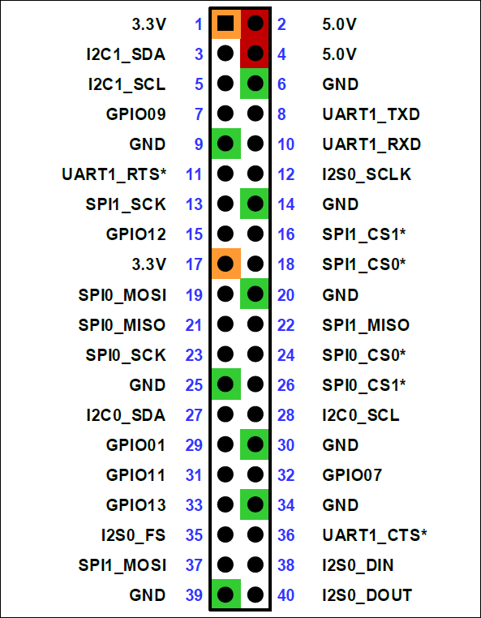
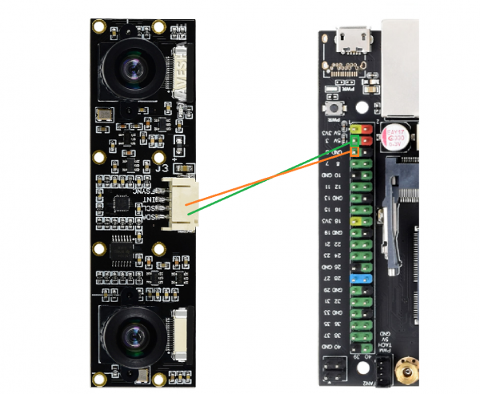
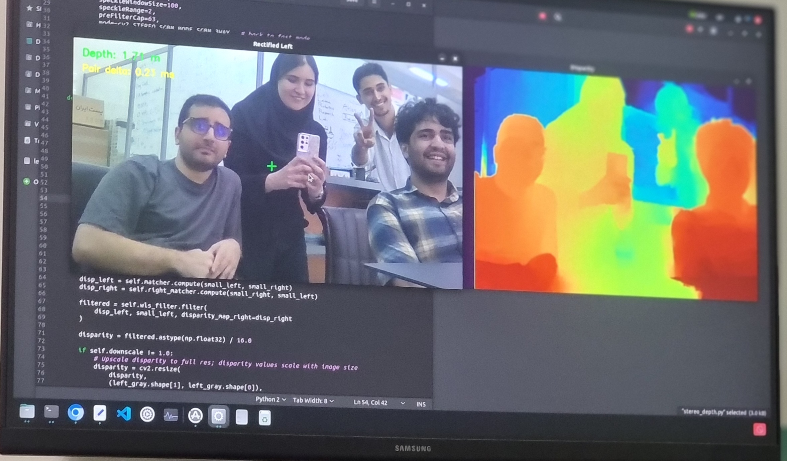

# Lenna Stereo Camera

## Overview

This repository contains the full software stack for running a dual **IMX219-83 stereo camera module** on an **NVIDIA Jetson Orin Nano**. It covers everything from raw dual-CSI capture to stereo calibration, disparity/depth estimation, IMU (ICM-20948) integration, and ROS 2 (Humble) nodes for publishing synchronized stereo images, camera info, IMU data, and computed depth.

The project is organized so each piece can be used independently:

- Capture and preview the two CSI cameras directly (Python or C++, no ROS required).
- Calibrate the stereo pair and generate rectification/disparity maps.
- Compute real-time depth/disparity from the stereo pair.
- Read orientation/acceleration data from the onboard ICM-20948 IMU.
- Run everything as ROS 2 nodes for integration into a larger robotics stack.

## Repository Structure

```text
Lenna-Stereo-Camera/
├── Python/                 # Standalone Python capture, preview, and depth scripts
│   ├── camera.py
│   ├── camera_test.py
│   ├── depth_test.py
│   ├── stereo_depth.py
│   └── README.txt
├── Cpp/                    # Standalone C++ dual CSI camera capture (no ROS)
│   ├── dual_csi_camera.cpp
│   └── dual_csi_camera        # compiled binary
├── Calibration/             # Stereo calibration capture, computation, and verification
│   ├── stereo_calibration_capture.py
│   ├── calibration.py
│   ├── stereo_calibration.npz  # pre-computed calibration for the reference rig
│   └── readme.md
├── IMU/                     # ICM-20948 IMU driver and demo (C, no ROS)
│   ├── ICM20948.c / .h
│   ├── main.c
│   ├── Makefile
│   └── ICM20948_Demo
├── ROS/                     # ROS 2 (Humble) packages
│   ├── stereo_camera/          # C++ camera + IMU nodes, publishes image/camera_info/imu topics
│   └── stereo_depth_node/      # Python node, subscribes to stereo images and publishes depth
├── images              
├── LICENSE
└── README.md                # This file
```

Each folder above has (or will have) its own `README.md` describing its specific usage in more detail.

## Installation

### Hardware / platform

- NVIDIA Jetson Orin Nano (JetPack / L4T with GStreamer + `nvarguscamerasrc` support)
- Two IMX219-83 CSI camera sensors connected to the Jetson's CSI ports
- ICM-20948 IMU connected over I2C 

<p align="center">
  
  <br>
  <em>Jetson Orin Nano's Pinout</em>
</p>

<p align="center">
  
  <br>
  <em>IMU's Connection to Board</em>
</p>

### Dependencies

**Python scripts (`Python/`, `Calibration/`):**

```bash
sudo apt update
sudo apt install python3-opencv python3-numpy
# cv2.ximgproc (used for WLS-filtered disparity) requires opencv-contrib:
pip3 install opencv-contrib-python
```

**C++ standalone capture (`Cpp/`):**

```bash
sudo apt install build-essential libopencv-dev
```

**IMU driver (`IMU/`):**

```bash
sudo apt install build-essential
# Uses I2C — the IMU must be enabled/wired per Pinout.png
```

**ROS 2 packages (`ROS/`):** ROS 2 Humble, plus:

```bash
sudo apt install \
  ros-humble-camera-calibration-parsers \
  ros-humble-camera-info-manager \
  ros-humble-cv-bridge \
  ros-humble-message-filters \
  libopencv-dev

# or, from within the workspace:
rosdep install --from-paths src --ignore-src -r -y
```

## Running

- **Python capture/preview:**
  ```bash
  cd Python
  python3 camera_test.py
  ```
- **Python stereo depth:** place a `stereo_calibration.npz` file in `Python/` (see `Python/README.txt`), then:
  ```bash
  python3 depth_test.py
  ```
- **C++ standalone capture:**
  ```bash
  cd Cpp
  g++ dual_csi_camera.cpp -o dual_csi_camera `pkg-config --cflags --libs opencv4` -lpthread
  ./dual_csi_camera
  ```
- **Calibration:** see `Calibration/readme.md` for the capture and verification commands.
- **ROS 2:** see `ROS/stereo_camera/README.md` and `ROS/stereo_depth_node/README.md` for build and `ros2 launch` instructions.

Refer to each subfolder's own README for full details, parameters, and troubleshooting.

## Outputs

Sample result of depth algorithm capturing the Lenna Team.

<p align="center">
  
  <br>
  <em>True Friendship Builds Dreams</em>
</p>
